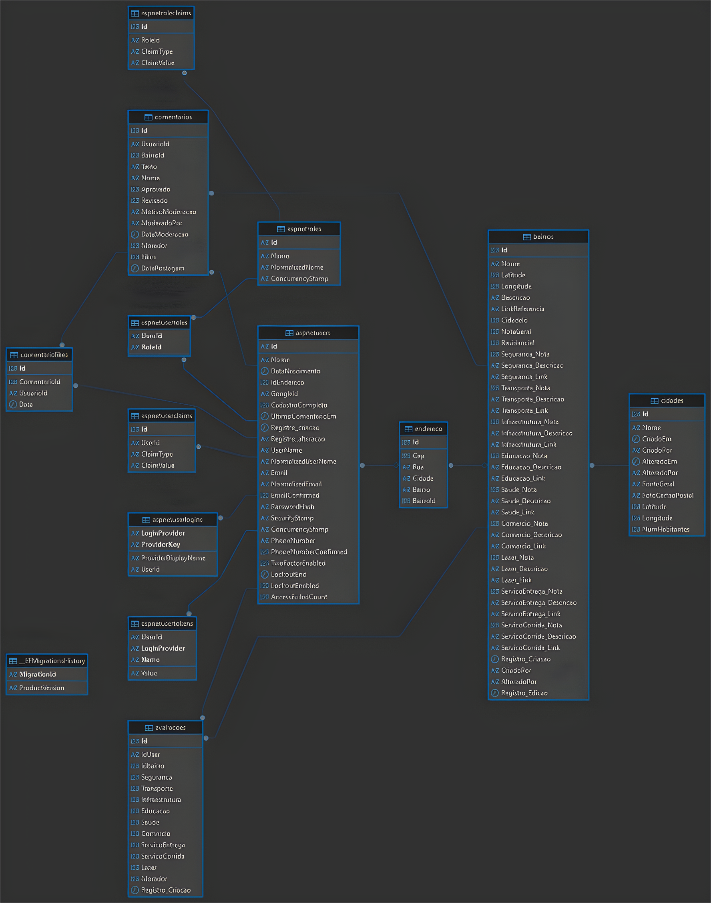

<p align="center">
  
  
</p>

<h1 align="center">InfoBairro</h1>

<p align="center">
  <strong>Inteligência Urbana e Georreferenciamento</strong>
</p>

<p align="center">
  
  
 
</p>


---

## 📝 1. Descrição do Projeto

O **InfoBairro** é uma plataforma Web Georreferenciada desenvolvida para empoderar os moradores. Através de um mapa interativo, a comunidade pode avaliar a infraestrutura (segurança, limpeza, mobilidade) de seus bairros, gerando dados reais que combatem a falta de informações atualizadas em canais oficiais.

---

## 🚀 2. Core Features (Funcionalidades)

- 🗺️ **Mapa Interativo:** Visualização georreferenciada de bairros e pontos de interesse.  
- ⭐ **Sistema de Ratings:** Avaliações de 1 a 5 estrelas em categorias críticas de infraestrutura.  
- 🛡️ **Painel de Moderação:** Interface administrativa para curadoria de conteúdo e segurança da plataforma.  
- 📊 **Data Intelligence:** Transformação de relatos em relatórios de tendência para o setor imobiliário e comercial.  
- 👤 **Gestão de Perfis:** Cadastro seguro com autenticação e recuperação de senha.  

---

## 💻 3. Tech Stack (Tecnologias)

- **Backend:** C# | ASP.NET Core MVC  
- **Frontend:** Razor Pages, Bootstrap 5, JavaScript  
- **Banco de Dados:** MariaDB (Relacional) com Entity Framework Core  
- **Arquitetura:** MVC (Model-View-Controller)  
- **Segurança:** Criptografia de senhas (Hash) e protocolo HTTPS  

---

## 🎲 4. Banco de Dados

A estrutura do banco de dados é responsável por organizar as informações do sistema 
e permitir que eles se relacionam de de forma eficiente. A seguir, é apresentada a organização 
e a relação entre as informações. 

<br> 

  ### 💡 4.1 Visão geral
  O banco de dados do InfoBairro segue o modelo relacional, onde as informações são organizadas em tabelas conectadas entre si.

  Exemplificação:
  - Cidades -> agrupam bairros 
  - Bairros -> possuem informações e indicadores gerais
  - Avaliações -> representam a opinião dos urios sobre os bairros

<br> 

  ### 🧠 4.2 Analogia simples 
  
Funciona como um sistema de avaliações:

  - A cidade organiza os locais em uma região maior
  - Cada bairro representa um lugar que pode ser analisado
  - As avaliações são as experiências e notas dadas pelo urios

Com isso, o sistema consegue transformar opiniões individuais em uma visão geral sobre cada bairro.

<br> 

  ### 🪢 4.3  Relacionamentos (DER)
O modelo estabelece as seguintes relações entre as entidades:

- Uma cidade pode possuir vários bairros (relação 1:N).
- Um bairro pode conter diversas avaliações (relação 1:N).

Esse encadeamento permite estruturar os dados de forma hierárquica, partindo da cidade até as avaliações associadas a cada bairro.

📌 Fluxo simplificado:

``` Cidade -> vários Bairros -> várias Avaliações ```


O Diagrama Entidade-Relacionamento (DER) apresentado abaixo ilustra essas conexões, além de detalhar as principais entidades, seus atributos e como elas se relacionam dentro do sistema.     

<br> 



<br> 

 ### ⚠️ 4.4 Observação importante (regra do sistema)

As notas não ficam armazenadas prontas na tabela de bairros. Elas são calculadas dinamicamente no sistema (backend).

Isso acontece porque:
- Evita inconsistência de dados
- Garante que as médias estejam sempre atualizadas
- Melhora a lógica de negócio

✔️ Ou seja:
As notas são calculadas a partir da tabela de avaliações.


---

## 🚀 5. Implantação do Banco de Dados

A implantação do banco de dados do **InfoBairro** é realizada de forma automatizada através do **Entity Framework Core**, garantindo que o ambiente possa ser reproduzido do zero em uma máquina limpa.

O sistema utiliza **migrações automáticas** e, ao iniciar a aplicação, verifica se o banco já existe. Caso não exista, ele é criado automaticamente, juntamente com todas as tabelas e dados iniciais necessários.

<br> 

### 📌 5.1 Pré-requisitos

Antes da implantação, é necessário ter instalado:

- **.NET SDK 8+**
- **MySQL 8+ ou MariaDB 10+**
- **Git**
- **Entity Framework Core CLI** (opcional)

Para instalar a CLI:

```bash
dotnet tool install --global dotnet-ef
```


 #### 🔹 Passo 1: Clonar o repositório

```bash
git clone <https://github.com/seu-repositorio/InfoBairro.git>
cd InfoBairro
```


 #### 🔹 Passo 2: Configurar a conexão com o banco

No arquivo `appsettings.json`, preencher a chave `DefaultConnection`:

```json
"ConnectionStrings": {
  "DefaultConnection": "server=localhost;database=infobairro;user=root;password=senha;port=3306"
}
```

> 💡 Em ambiente de produção, recomenda-se utilizar variáveis de ambiente para proteger as credenciais.
> 


 #### 🔹 Passo 3: Executar a aplicação

```bash
dotnet run
```

Ao iniciar, o sistema executa automaticamente a migração do banco através do seguinte trecho presente no código:

```csharp
await context.Database.MigrateAsync();
```

Esse processo realiza:

- criação automática do banco, caso não exista
- criação de todas as tabelas
- aplicação das migrations pendentes
- atualização da estrutura do schema


 #### 🔹 Passo 4: Seed inicial do sistema

Após a criação do banco, o sistema executa a carga inicial de dados obrigatórios:

```csharp
await Seed.SeedRoles(roleManager);
await Seed.SeedMasterUser(userManager);
```

São criados automaticamente:

- perfis de acesso (**roles**)
- usuário administrador master
- permissões iniciais do sistema

Isso garante que o ambiente esteja pronto para uso logo após a primeira execução.


<br> 

 ### ✅ 5.2 Validação pós-implantação

Após a inicialização, validar se as tabelas foram criadas corretamente:

```sql
SHOW TABLES;
```

Resultado esperado (exemplo):

- `cidades`
- `bairros`
- `avaliacoes`
- `comentarios`
- `comentariolikes`
- `aspnetusers`
- `aspnetroles`

Também é recomendado validar a existência do usuário master e das roles iniciais.


<br> 

 ### 🔍 5.3 Teste de funcionamento

Executar consultas simples para validar a integridade:

```sql
SELECT * FROM cidades;
SELECT * FROM bairros;
SELECT * FROM aspnetroles;
```

<br> 

 ### 🔄 5.4  Rollback / Limpeza

Caso seja necessário desfazer a implantação:

### Voltar para migration anterior

```bash
dotnet ef database update NomeMigrationAnterior
```

 ### 🗑️ 5.5 Remover banco completamente

```sql
DROP DATABASE infobairro;
```

<br> 

 ### 🛡️ 5.6 Observação técnica

O sistema utiliza:

- **retry automático de conexão**
- **migrations automáticas**
- **seed inicial**
- **exclusão em cascata**
- **índices únicos**

Essas práticas garantem maior confiabilidade na implantação e manutenção do ambiente.

---

## ✅ 6 Validação Pós-Implantação

Após a implantação do banco de dados, foi realizado um processo de validação para garantir que toda a estrutura, os relacionamentos e os dados iniciais do sistema foram criados corretamente.

Essa etapa é fundamental para assegurar que o ambiente está pronto para uso e que a aplicação consegue persistir e consultar informações sem inconsistências.


<br> 

 ### 🗄️ 6.1 Validação da Estrutura do Banco

A primeira etapa consiste em verificar se todas as tabelas foram criadas com sucesso após a execução das migrations automáticas.

Execute no MySQL / MariaDB:

```sql
SHOW TABLES;
```

 ### 📌 6.2 Resultado esperado

O banco deve conter, no mínimo, as seguintes tabelas principais:

- `cidades`
- `bairros`
- `avaliacoes`
- `comentarios`
- `comentariolikes`
- `emailverificationcodes`
- `aspnetusers`
- `aspnetroles`
- `aspnetuserroles`

> 💡 As tabelas `aspnet*` são geradas automaticamente pelo [**ASP.NET](http://asp.net/) Identity**, responsável pelo sistema de autenticação e autorização.
> 


<br> 

 ### 👤 6.3 Validação do Seed Inicial

Durante a inicialização da aplicação, o sistema executa automaticamente a carga inicial de dados através dos métodos:

```csharp
await Seed.SeedRoles(roleManager);
await Seed.SeedMasterUser(userManager);
```

Essa etapa garante que o sistema já possua os perfis de acesso e o usuário administrador master.

Para validar, execute:

```sql
SELECT * FROM aspnetroles;
SELECT * FROM aspnetusers;
```

 ### 📌 6.4 Verificar

- existência dos perfis de acesso
- existência do usuário administrador
- e-mail e permissões iniciais

Exemplo esperado:

- `Admin`
- `Moderador`
- `Usuario`


<br> 

 ### 🔗 6.5 Validação de Integridade Referencial

O banco utiliza **chaves estrangeiras e exclusão em cascata**, garantindo que os relacionamentos entre tabelas permaneçam consistentes.

Validar os principais relacionamentos:

```sql
SELECT * FROM cidades;
SELECT * FROM bairros;
SELECT * FROM avaliacoes;
SELECT * FROM comentarios;
```

 ### 📌 6.6 Conferir

- cada bairro deve possuir `CidadeId`
- cada avaliação deve possuir `Idbairro` e `IdUser`
- cada comentário deve possuir `BairroId` e `UsuarioId`

Essa etapa confirma que os relacionamentos definidos no `Context.cs` foram aplicados corretamente.


<br> 

 ### 🌐 6.7 Validação Funcional da Aplicação

Após a validação estrutural, foram realizados testes diretamente na interface do sistema para comprovar a persistência dos dados.

 ### 📌 6.8 Testes executados

- cadastro de usuário
- login e autenticação
- criação de avaliação
- envio de comentário
- carregamento do mapa interativo
- validação de likes em comentários

Após cada operação, os dados foram conferidos no banco por meio de consultas SQL.

Exemplo:

```sql
SELECT * FROM avaliacoes;
SELECT * FROM comentarios;
```


<br> 

 ### ⚡ 6.9 Validação de Regras de Negócio

Também foram validadas regras críticas implementadas no banco e na aplicação:

- não permitir duplicidade de likes por usuário no mesmo comentário
- impedir duplicidade de bairros na mesma cidade
- exclusão em cascata de registros relacionados

Exemplo de teste:

```sql
SELECT * FROM comentariolikes;
```

> 💡 O sistema possui índice único para impedir múltiplos likes do mesmo usuário no mesmo comentário.
> 


<br> 

 ### 🛡️ 6.10 Evidência de Teste

A validação pós-implantação foi executada em ambiente local pela equipe após a aplicação automática das migrations, confirmando que o banco está funcional e pronto para uso no MVP.

---

## 🔄 7. Rollback / Limpeza do Banco de Dados

O rollback do banco pode ser realizado por meio das **migrations versionadas do Entity Framework Core**, garantindo reversão segura para versões anteriores da estrutura.

<br>

### ⏪ 7.1 Reverter para migration anterior

```bash
dotnet ef migrations list
dotnet ef database update NomeMigrationAnterior
```

<br>

### 💾 7.2 Backup Preventivo (Recomendado)

Procedimento recomendado para backup preventivo:

```bash
mysqldump -u root -p infobairro > backup_infobairro.sql
```

Para restauração:

```bash
mysql -u root -p infobairro < backup_infobairro.sql
```

---

## 🖥️ 8. Requisitos do Servidor

Antes de realizar o deploy, o servidor deve atender aos seguintes requisitos mínimos:

### 🧩 Sistema Operacional

* Windows Server com suporte a IIS
  **ou**
* Linux com suporte ao runtime/framework utilizado no projeto

### ⚙️ Recursos mínimos recomendados

* **Processador:** 2 vCPUs ou superior
* **Memória RAM:** 4 GB mínimo
* **Armazenamento:** 20 GB livres ou mais
* **Rede:** acesso à internet para dependências e integração com GitHub

### 📦 Dependências obrigatórias

* IIS instalado e habilitado (Windows)
* .NET Runtime / Hosting Bundle compatível
* Banco de dados disponível e acessível
* Git instalado no servidor
* Permissão administrativa para configuração

### ✅ Recomendações adicionais

* Ambiente separado para produção
* Logs habilitados
* Backup antes de atualizações
* Variáveis de ambiente para dados sensíveis

---

## 📁 9. Estrutura Esperada do Projeto

Antes do deploy, o projeto deve conter:

* Código fonte versionado no GitHub
* Configuração separada por ambiente
* Conexão com banco parametrizada
* Build funcionando localmente
* Dependências restauráveis

---

## 🚀 10. Passo a Passo do Deploy via GitHub

### 🔧 10.1 Preparar o repositório

* Enviar projeto para o GitHub
* Garantir branch principal estável
* Configurar `.gitignore` corretamente
* **Não versionar dados sensíveis**, como:

  * Strings de conexão
  * Chaves de API
  * Senhas
  * Tokens

---

### 🖥️ 10.2 Preparar o servidor

* Acessar com conta administrativa
* Instalar dependências:

  * IIS (Windows)
  * Runtime do projeto
  * Git / Web Deploy
* Criar pasta da aplicação
* Ajustar permissões

---

### ⚙️ 10.3 Configurar ambiente

* Criar site no IIS (ou equivalente)
* Definir diretório físico
* Configurar pool de aplicação
* Ajustar permissões
* Configurar variáveis de ambiente

---

### 🔄 10.4 Configurar deploy

#### 🔹 Opção A: GitHub Actions

* Criar workflow
* Pipeline deve:

  * Restaurar pacotes
  * Compilar
  * Publicar
  * Enviar ao servidor
* Configurar **secrets**
* Validar execução do deploy

#### 🔹 Opção B: Deploy manual

* Gerar publish
* Enviar arquivos ao servidor
* Substituir versão antiga
* Reiniciar aplicação

---

### 🗄️ 10.5 Banco de dados

* Configurar connection string
* Executar migrations ou scripts
* Validar estrutura e dados

---

### 🧪 10.6 Testes

* Acessar sistema
* Validar funcionalidades:

  * Autenticação
  * Cadastro
  * Consulta
  * Edição
  * Exclusão
* Verificar logs

---

## 🔄 11. Fluxo com GitHub Actions

Fluxo recomendado:

1. Commit no GitHub
2. Pipeline executa build
3. Deploy no servidor
4. Aplicação reiniciada
5. Sistema disponível

---

## 🧠 12. Boas Práticas

* Não salvar segredos no código
* Usar variáveis de ambiente
* Manter backups
* Registrar logs
* Testar em homologação
* Versionar corretamente
* Ter plano de rollback

---

## ✅ 13. Checklist Final

* [ ] Repositório atualizado
* [ ] Runtime instalado
* [ ] IIS configurado
* [ ] Banco acessível
* [ ] Connection string correta
* [ ] Build sem erros
* [ ] Deploy concluído
* [ ] Aplicação acessível
* [ ] Funcionalidades testadas

---

## ⚠️ 14. Observações Importantes

* Em ambientes como AWS, pode envolver:

  * EC2
  * Security Groups
  * Storage externo

* Em servidores próprios:

  * Processo semelhante
  * Diferença na infraestrutura

➡️ O mais importante é garantir que o ambiente final suporte a aplicação com **estabilidade e segurança**.

---

## 📈 15. Roadmap & Project Status 

O projeto encontra-se atualmente em fase de **MVP (Mínimo Produto Viável)**.

- [x]  **Phase 1 (2025.1):** Design (Figma), Modelagem de Dados (Diagramas ER) e Proposta de Valor
- [x]  **Phase 2 (2025.2):** Desenvolvimento do Core (Back-end, Front-end e Integração com DB)
- [ ]  **Phase 3 (2026.1):** PM Canvas, Plano de Projeto, Adição de bairros, Plano de Manutenção de Sistemas, EAP, Teste de Sistema, Dashboard, Correção de bugs no código, Correção do Pitch e Slide Final.  *(Status Atual 🛠️)*
- [ ]  **Futuro:** Implementação de IA para análise de sentimento e Aplicativo Mobile nativo

---

## 🌐 16. Disponibilidade e Acesso

O **InfoBairro** é uma plataforma web de acesso público. Por se tratar de um sistema proprietário voltado à gestão urbana de Camaçari, o código-fonte reside em um repositório privado, enquanto a aplicação está disponível para uso da comunidade.

<br> 

 ### 🔗16.1 Link de Acesso
O sistema pode ser acessado através do link oficial:
> **https://infobairro.com/**

<br> 

 ### 📱 16.2 Experiência do Usuário
* **Web Responsiva:** Otimizado para navegadores Desktop e Mobile (Chrome, Edge, Safari).
* **Sem Necessidade de Instalação:** Acesso direto via navegador, sem ocupar espaço no dispositivo.
* **Mapa em Tempo Real:** Carregamento dinâmico de dados georreferenciados via infraestrutura Cloud.

---

## 🛠️ 17. Infraestrutura e Deployment (Bastidores)

Embora o código seja privado, a arquitetura de publicação segue padrões modernos de escalabilidade:

* **Hospedagem:** Servidor Cloud configurado para alta disponibilidade (Uptime de 99%).
* **Segurança:** Camada de proteção SSL (HTTPS) para navegação segura dos usuários.
* **Banco de Dados:** Instância MariaDB dedicada para armazenamento seguro e anonimizado.
* **Integração:** Pipeline de deploy automatizado para atualizações de melhorias (Roadmap 2026).

---

## 🧱 18. Arquitetura de Software


* **Padrão de arquitetura:** O sistema segue o padrao MVC com divisão clara de responsabilidades (Controllers, Models, Views).

 * **Camada de Dados:** Utiliza o Entity Framework como ORM para acesso ao banco de dados e MySQL como SGBD.
   
 * **Autenticação:** ASP.NET Core Identity para controle de acesso, cadastro de usuarios, login e logout
 
* **Front-end:** O sistema utiliza do Framework Bootstrap 5, a renderização das páginas é feita com a engine Razor, permitindo a criação de conteúdos dinâmicos integrados ao back-end, facilitando a exibição de dados e a interação com o usuário e JavaScript para interação no lado do cliente.

---
  
## 👥 19. Equipe e Engenharia de Software

O **InfoBairro** é o resultado da colaboração estratégica entre especialistas em diferentes frentes de desenvolvimento.

 ### 🛠️ Core Team & Responsabilidades

| Membro | Role (Papel Técnico) | Especialidades no Projeto |
| :--- | :--- | :--- |
| **Gabriel Oliveira** | **Team Lead & Full Stack Developer** | Liderança de equipe, arquitetura ponta a ponta e gestão de entregas. |
| **Enya Arruda** | **BI Analyst & Frontend Engineer** | Análise de dados, implementação de UI e documentação técnica. |
| **Nicolly Brito** | **UI/UX Designer & Frontend** | Design de interface, experiência do usuário e documentação técnica. |
| **Arthur Michelângelo** | **Data Architect & Documentation** | Modelagem e alimentação de banco de dados, documentação e frontend. |
| **Leandro Rivas** | **Full Stack Developer & Designer** | Desenvolvimento de regras de negócio (Back), UI Design e Frontend. |

 ### 🏛️ Parcerias e Apoio Técnico
* **SENAI Camaçari:** Suporte em infraestrutura de laboratórios e orientação acadêmica.
* **Corpo Docente:** Mentoria técnica especializada em arquitetura .NET e Governança de Dados.

---


<p align="center">
  <sub><strong>Projeto desenvolvido no SENAI Camaçari • 2026</strong></sub><br>
  <sub><font size="1">Arthur Michelângelo • Enya Arruda • Gabriel Oliveira • Leandro Rivas • Nicolly Brito</font></sub>
</p>
